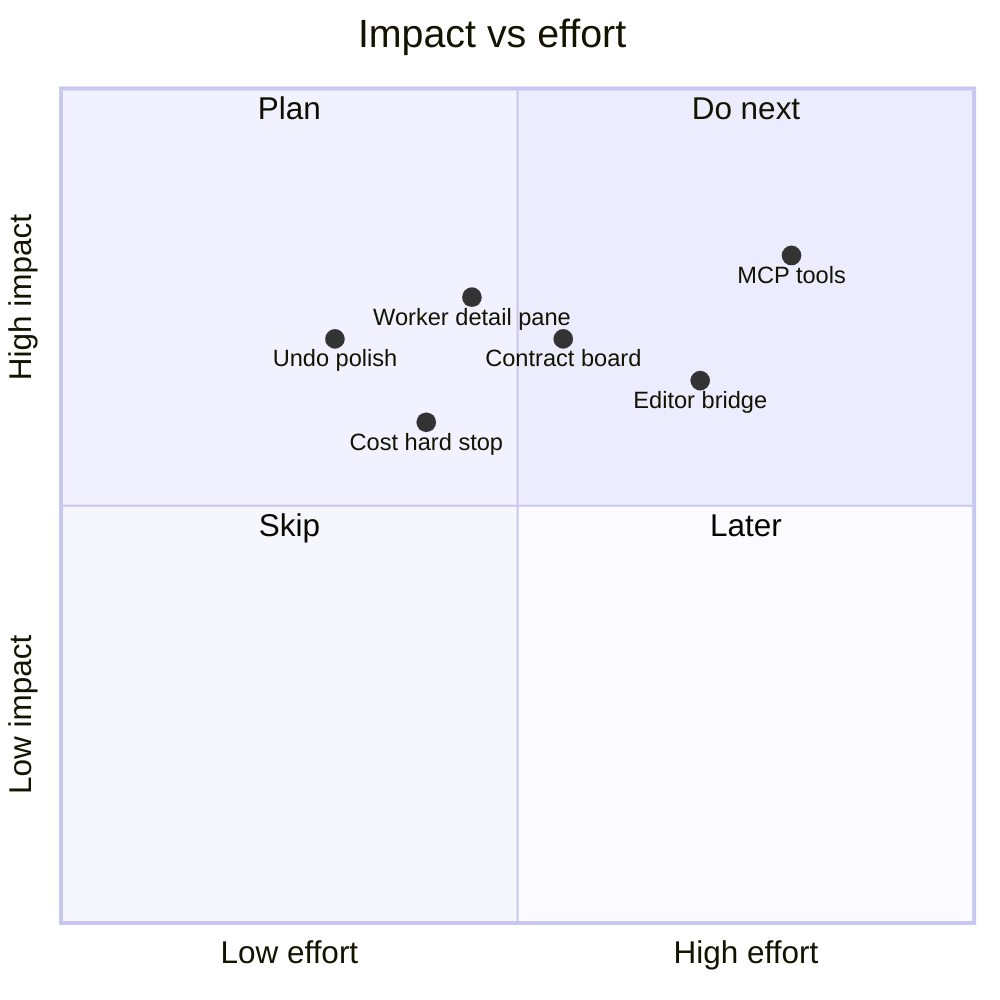

# ArrowCode — features & roadmap

## Shipped in v1.0.0 (first public release)

### Harness
- [x] Plan → questions → `/confirm` → execute → `/accept`
- [x] Continuous execute cycles + re-tasking
- [x] Human accept / reject / stop
- [x] Goal + checklist + 12 templates
- [x] Context trim + summarize
- [x] **Session management** (workspace `.arrowcode-sessions/`)
- [x] Session durable memory injected each turn
- [x] Metrics + timeline + `/replay`
- [x] File tracker + diff panel
- [x] `ARROW.md` project brain

### Security
- [x] Workspace path sandbox
- [x] Sensitive path deny
- [x] Secret scan on writes
- [x] Bash allowlist
- [x] Dry-run mode
- [x] Token budget soft-stop
- [x] Checkpoints + `/undo`

### Multi-agent + swarm
- [x] ORCH · FE · BE · QA
- [x] Bus + spawn_worker (depth 2, max 16)
- [x] Live swarm map
- [x] Per-agent API/model

### TUI dashboard
- [x] 2×2 agents · plan · swarm · files · diff · bus · timeline

### Packaging
- [x] Flat GitHub template layout
- [x] `defaults/` in repo; `~/.arrowcode` only if you install
- [x] install.sh / install.ps1

---

## Suggested next features

### P0
1. Worker detail pane (focus swarm node → its log)  
2. Richer unified diff hunks  
3. `/undo` multi-step stack UI in dashboard  

### P1
4. FE/BE **contract board** panel  
5. Path allow/deny custom globs in settings  
6. Session picker overlay (not only slash commands)  

### P2
7. MCP tool bridge  
8. VS Code/Zed diff open  
9. Hard cost/token stop with user confirm to continue  

### P3
10. Plugin skills marketplace format  
11. Cloud headless workers  
12. Theme pack  

---

## Docs with diagrams

- [ARCHITECTURE.md](docs/ARCHITECTURE.md)  
- [SESSIONS.md](docs/SESSIONS.md)  
- [SECURITY.md](docs/SECURITY.md)  
- [TOOLS.md](docs/TOOLS.md)  
- [INSTALL.md](docs/INSTALL.md)  

- [x] `src/perf/` — caches, timers, parallel tools, fast context, debounce
- [x] Parallel read-only tool batches (up to 8)
- [x] Pure-trim context path (skip summarize when possible)
- [x] Personality + system prompt + file content caches
- [x] Session disk save coalescing (250ms)
- [x] Faster idle detection (120ms poll / 400ms settle)
- [x] `/perf` and `/perf reset`

