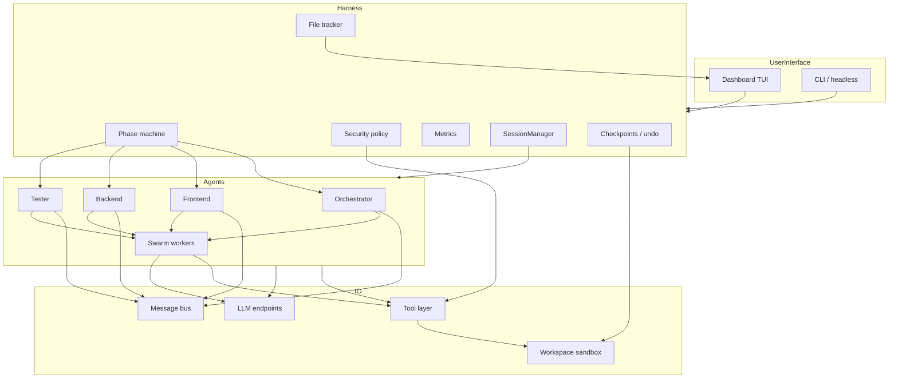
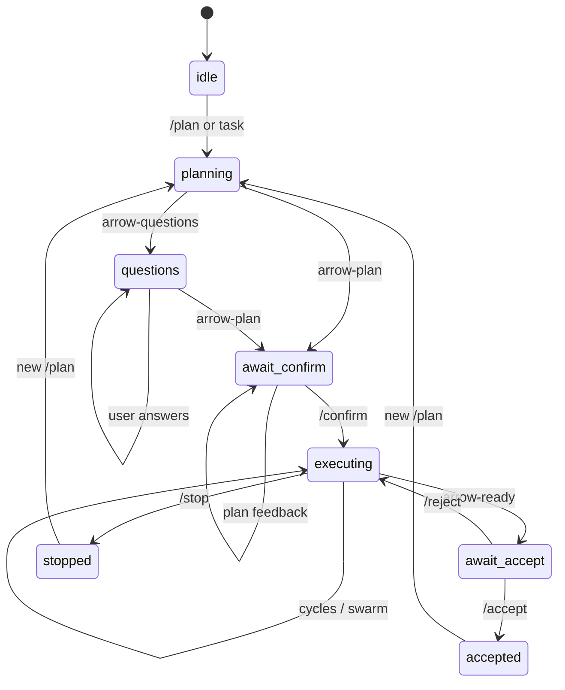
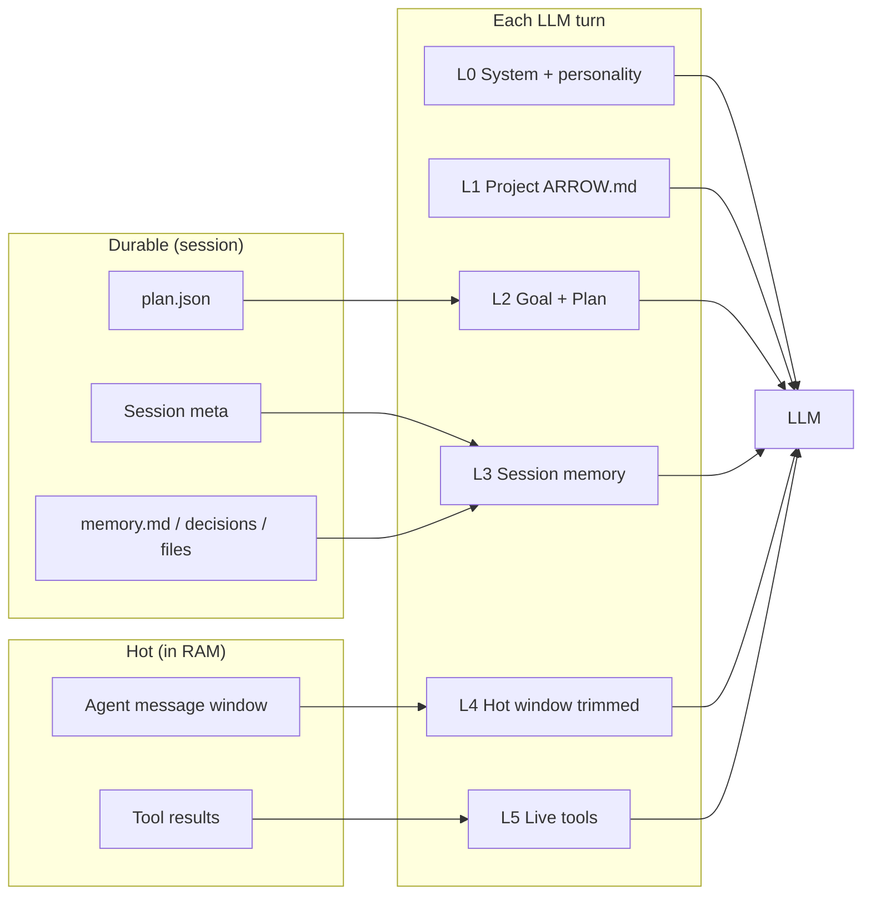
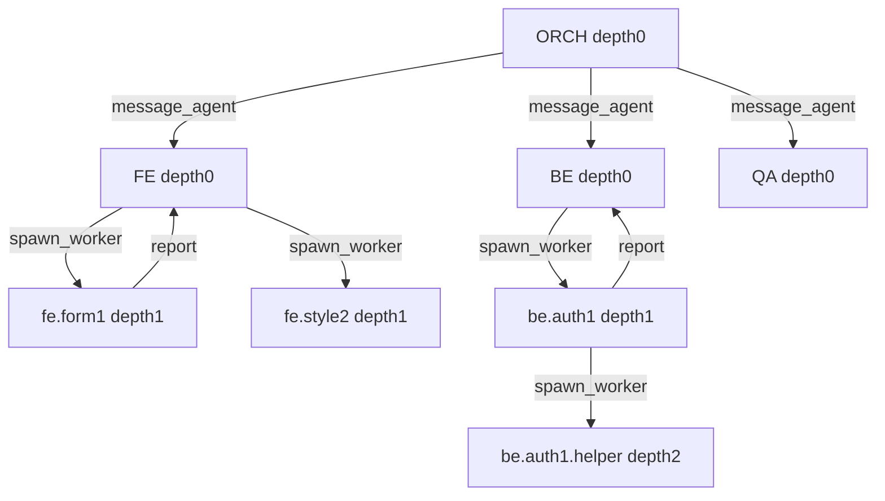
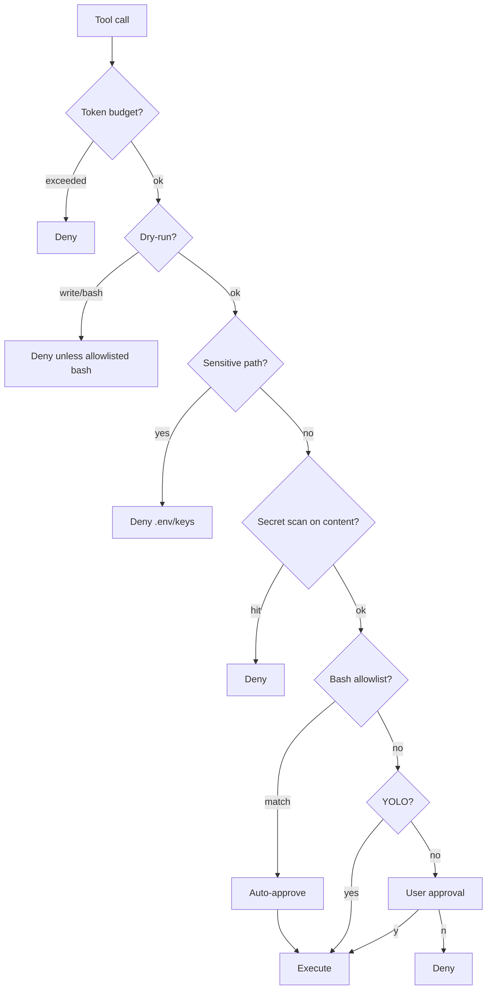
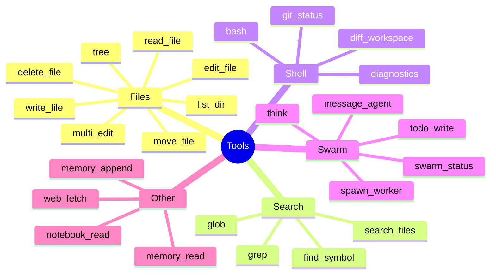
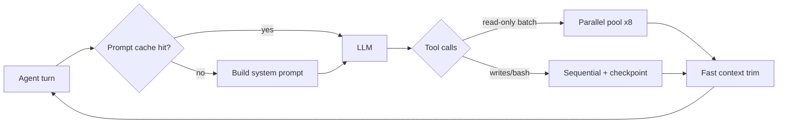
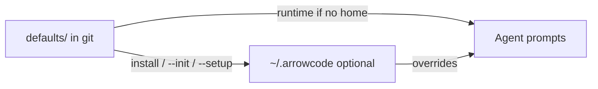

# Architecture

## System overview

## Phase machine

## Session + context layers

### How session memory works

| Store | Path | Purpose |
|-------|------|---------|
| Session index | `<workspace>/.arrowcode-sessions/index.json` | List / pick sessions |
| Meta | `.../<id>/meta.json` | phase, tokens, status, goal ref |
| Memory | `.../<id>/memory.json` + `memory.md` | decisions, notes, files, summary |
| Events | `.../<id>/events.jsonl` | append-only timeline |
| Plan | `.../<id>/plan.json` | last confirmed/draft plan |
| Digests | `.../<id>/digests.json` | per-agent compact resumes |

**Commands:** `/session new` · `/session list` · `/session load <id>` · `/session save` · `/session memory [note]` · `/session delete <id>`

**Context policy**

1. Durable session memory is re-injected every turn (L3).  
2. Hot window (L4) is summarized when large → summary written into session memory.  
3. Hot window is trimmed to `contextBudgetChars` with tool-pair sanitization.  
4. No global `~/.arrowcode` required for sessions (workspace-local).

## Swarm

Caps: maxWorkers=16 · maxDepth=2 · maxChildrenPerAgent=4

## Security policy pipeline

## Tool surface

## Layers (code)

| Layer | Path | Role |
|-------|------|------|
| TUI | `src/tui` | Dashboard |
| Harness | `src/core/harness.ts` | Phase + orchestration |
| Sessions | `src/session/manager.ts` | Durable session memory |
| Policy | `src/core/policy.ts` | Security gates |
| Checkpoints | `src/core/checkpoints.ts` | Undo |
| Swarm | `src/swarm` | Workers |
| Agents | `src/agents` | Tool loops |
| Tools | `src/tools` | Sandboxed IO |
| Bootstrap | `src/bootstrap` | defaults → optional ~/.arrowcode |
| Perf | `src/perf` | caches, parallel tools, fast context, timers |
| Sessions | `src/session` | durable workspace sessions |

## Lightning path

## Packaged defaults vs user home

