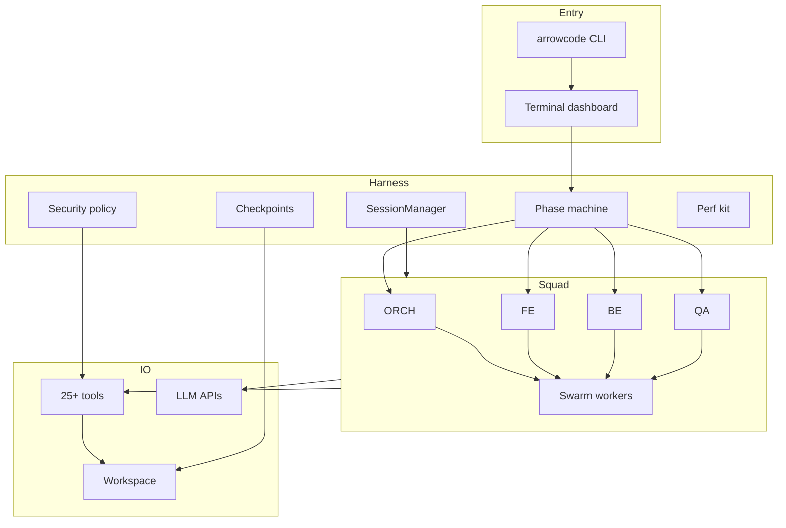
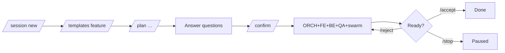
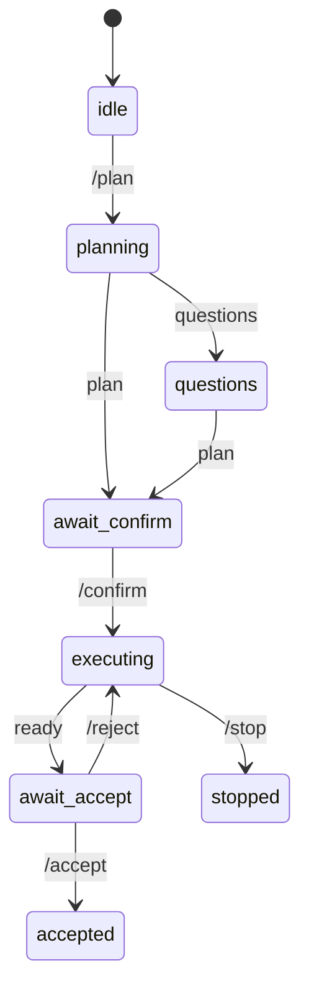
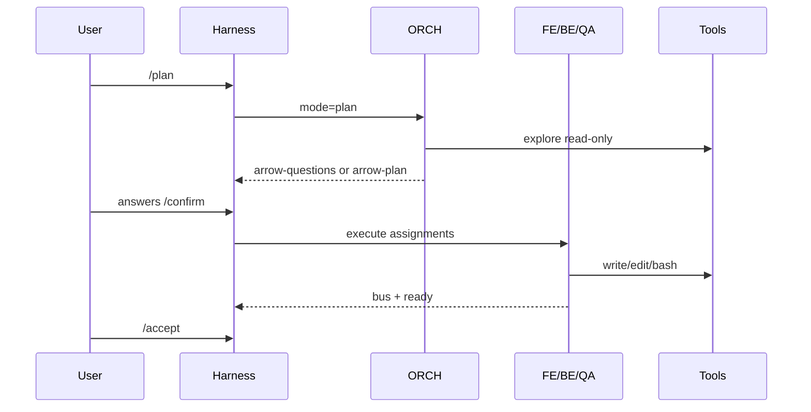
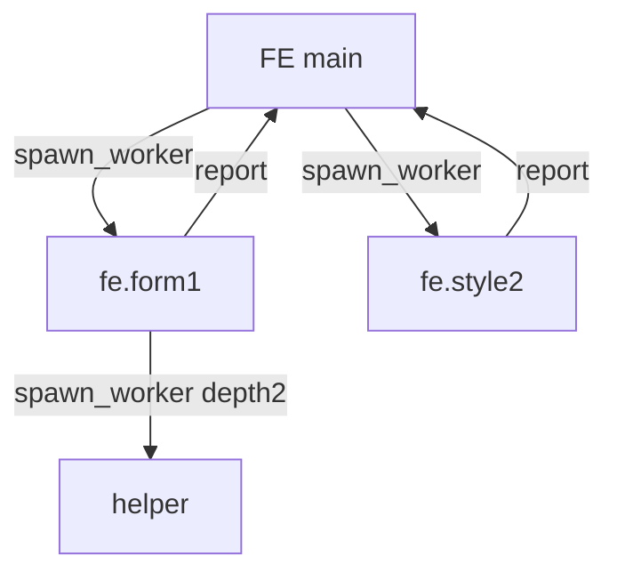
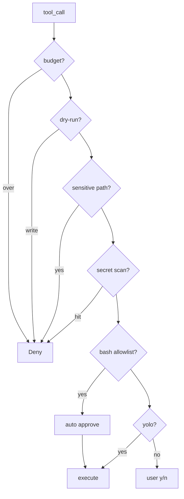
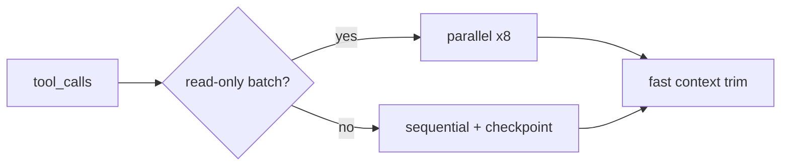
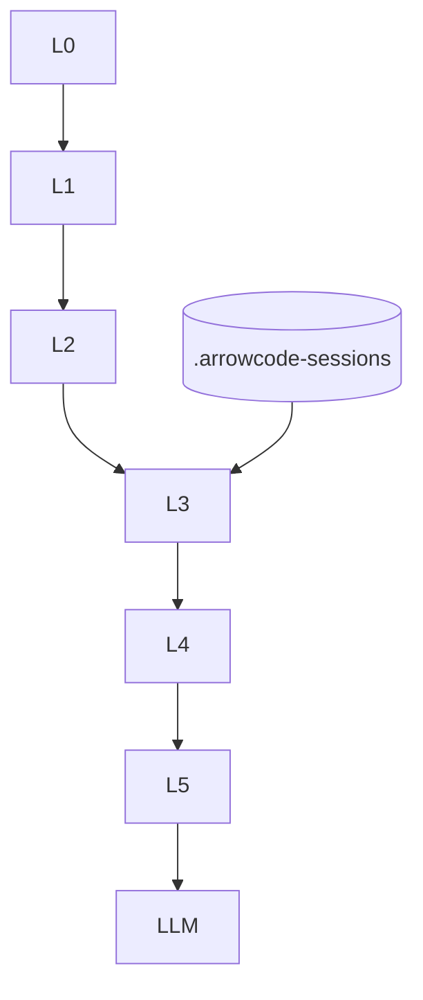

# ArrowCode Guide

>Complete working plans, command reference, and system flows.

<pre align=center>
┌ Header · provider/model · YOLO · swarm n/16 · RUNNING ─┐
│ phase EXECUTING · plan title                           │
├──────────────────────────────┬────────────┬────────────┤
│ ORCH          │ FE           │ PLAN       │ SWARM map  │
│ BE            │ QA           │ FILES      │ DIFF       │
├──────────────────────────────┴────────────┴────────────┤
│ AGENT BUS                          │ TIMELINE          │
│ > /plan /confirm /accept /session /help                │
└────────────────────────────────────────────────────────┘
</pre>

**Version:** 1.0.0 · Multi-agent swarm harness · Session memory · Lightning perf

---

## Table of contents

1. [Quick start](#1-quick-start)
2. [Master system map](#2-master-system-map)
3. [Working plans (playbooks)](#3-working-plans-playbooks)
4. [Slash command reference](#4-slash-command-reference)
5. [How each major flow works](#5-how-each-major-flow-works)
6. [Session memory & context](#6-session-memory--context)
7. [Security policy](#8-security-policy)
8. [Performance](#9-performance)
9. [Data on disk](#10-data-on-disk)
10. [Troubleshooting](#11-troubleshooting)

---

## 1. Quick start

**One-liner install (after publish — replace `YOUR_USER`)**

```bash
# Linux / macOS / WSL
curl -fsSL https://raw.githubusercontent.com/Chintanpatel24/arrowcode/main/install.sh | bash
```

```powershell
# Windows PowerShell
irm https://raw.githubusercontent.com/Chintanpatel24/arrowcode/main/install.ps1 | iex
```

**From a local clone**

```bash
# from repo root
bun install
./install.sh                 # optional: PATH + ~/.arrowcode from defaults/
export NVIDIA_API_KEY=nvapi-...   # or arrowcode --setup

cd /path/to/your-project
arrowcode
```

**First task loop**

```text
/session new my-feature
/templates fullstack
/plan Add health API and status page
# answer questions 1. … 2. …
/confirm
# watch dashboard agents + swarm
/accept
```


---

## 2. Master system map



---

## 3. Working plans (playbooks)

### Plan A — Ship a feature (default)



| Step | Command | What happens |
|------|---------|----------------|
| 1 | `/session new auth` | Durable workspace session |
| 2 | `/templates fullstack` | Checklist + guidance |
| 3 | `/plan …` | ORCH explores; asks or plans |
| 4 | answers `1. …` | Refines plan |
| 5 | `/confirm` | Execute loop; workers may spawn |
| 6 | `/review` optional | QA-focused pass |
| 7 | `/accept` | Session completed |

### Plan B — Bugfix

```text
/session new bug-null-checkout
/templates bugfix
/plan Fix null crash in checkout
/confirm
# after fix:
/review
/accept
```

### Plan C — Safe exploration (no writes)

```text
/dryrun on
/plan Evaluate migration to Postgres
# read-only explore; writes blocked
/dryrun off
```


### Plan E — Recover / undo

```text
/checkpoints
/undo
# or
/undo cp_…
```

### Plan E — Resume tomorrow

```text
/session list
/session load auth_mrg…
/session memory
# continue
/plan continue remaining checklist items
```

---

## 4. Slash command reference

### 4.1 Core loop

| Command | How it works |
|---------|----------------|
| `/plan [goal]` | Starts **planning** phase. ORCH may emit `arrow-questions` or `arrow-plan`. **No implement** until confirm. |
| `/confirm` | Moves to **executing**. Fans work to FE/BE/QA; swarm may spawn. Cycles until ready or max cycles. |
| `/execute` | Alias of `/confirm`. |
| `/reject [note]` | From **await_accept**, returns to execute with feedback. |
| `/accept [note]` | Marks goal done; completes session; optional snapshot. |
| `/stop` | Halts agents and swarm; phase **stopped**. |
| `/review [note]` | Assigns tester a review-first pass (tests preferred). |



### 4.2 Goal & templates

| Command | How it works |
|---------|----------------|
| `/goal` | Overlay: show goal + checklist. |
| `/goal <text>` | Set goal text (session + optional home). |
| `/templates` | List 12 templates. |
| `/templates <id>` | Apply checklist + guidance (`feature`, `bugfix`, …). |

### 4.3 Sessions

| Command | How it works |
|---------|----------------|
| `/session new [name]` | Creates `.arrowcode-sessions/<id>/` with meta + memory. |
| `/session list` / `/sessions` | Lists sessions; `*` = active. |
| `/session load <id>` | Restores phase, goal, plan; re-injects memory. |
| `/session save` | Flush coalesced disk write. |
| `/session memory` | Print durable L3 block. |
| `/session memory <note>` | Append decision/note. |
| `/session delete <id>` | Remove session folder. |

Storage: **workspace** `.arrowcode-sessions/` (not global home).


### 4.5 Safety & control

| Command | How it works |
|---------|----------------|
| `/yolo` | Toggle auto-approve **all** gated tools. |
| `/dryrun on\|off` | Block writes/bash (allowlisted bash still ok). |
| `/allowlist on\|off` | Auto-approve safe cmds (`npm test`, `tsc`, …). |
| `/secretscan on\|off` | Block writes matching key/token patterns. |
| `/budget N` | Soft-stop when tokens ≥ N (`0` = off). |
| `/undo [id]` | Restore last (or given) checkpoint from `.arrowcode-checkpoints/`. |
| `/checkpoints` | List undo snapshots. |

### 4.6 Agents, models, swarm

| Command | How it works |
|---------|----------------|
| `/agents` | Paths to personalities (`defaults/` or `~/.arrowcode/agents` if installed). |
| `/endpoints` | Resolved per-agent provider/model/key mask. |
| `/model [id]` | Show/set global model. |
| `/swarm` | Print worker tree + caps. |
| `/status` | Phase, cycle, dryRun, agent statuses. |
| `/cost` | Session metrics + swarm token stats. |
| `/clear` | Reset agent histories + phase idle. |
| `/compact` | Soft history reset. |

### 4.7 Dashboard / perf / system

| Command | How it works |
|---------|----------------|
| `/settings` | Fullscreen settings (Esc saves). |
| `/dashboard` | Refresh files/diff/swarm panels. |
| `/diff` | Refresh tracked diffs. |
| `/replay [name]` | Export timeline JSON. |
| `/perf` | Timers, counters, cache sizes. |
| `/perf reset` | Clear perf + caches. |
| `/init` | Create `~/.arrowcode` from `defaults/` (optional). |
| `/help` | Command panel. |
| `/exit` | Quit. |

### 4.8 Routing (not slash)

| Input | How it works |
|-------|----------------|
| `@fe …` | Message frontend only |
| `@be …` | Backend only |
| `@qa …` | Tester only |
| `@orch …` | Orchestrator only |
| `@all …` | Broadcast |
| free text in `questions` | Answers clarifying questions |
| free text in `await_confirm` | Plan feedback |
| free text in `idle` | Starts `/plan` |

---

## 5. How each major flow works

### 5.1 Plan → confirm → execute



### 5.2 Swarm workers



Caps: maxWorkers **16**, maxDepth **2**, maxChildrenPerAgent **4**.

### 5.3 Tool gate (security)



### 5.4 Lightning tool path



---

## 6. Session memory & context

### Layers each LLM turn

| Layer | Content | Lifetime |
|-------|---------|----------|
| L0 | System + personality + security | process |
| L1 | Workspace snapshot + `ARROW.md` | workspace |
| L2 | Goal + plan | session |
| L3 | **Session durable memory** | session |
| L4 | Hot messages (trim/summarize) | volatile |
| L5 | Tool results (truncated) | turn |



### Session files

```text
.arrowcode-sessions/
  index.json
  <id>/
    meta.json       # phase, tokens, status
    memory.json     # decisions, files, notes, summary
    memory.md       # human-readable
    events.jsonl    # timeline
    plan.json
    digests.json
```

---


## 8. Security policy

| Control | Default | Toggle |
|---------|---------|--------|
| Workspace sandbox | on | always |
| Deny `.env` / keys / `.ssh` | on | built-in |
| Secret scan on write | on | `/secretscan` |
| Bash allowlist | on | `/allowlist` |
| Dry-run | off | `/dryrun` |
| Token budget | off | `/budget` |
| YOLO | off | `/yolo` |
| Checkpoints | on write | `/undo` |

Optional global home (`~/.arrowcode`) only after `--init` / `--setup` / install — **not** required to run.

---

## 9. Performance

| Technique | Effect |
|-----------|--------|
| Parallel read tools | up to 8 concurrent |
| Prompt / personality / file caches | sub-ms hot path |
| Pure-trim context | skip LLM summarize when possible |
| Session save coalesce | 250ms batch |
| Idle poll 120ms | faster phase end |

```text
/perf
/perf reset
```

See [docs/PERFORMANCE.md](docs/PERFORMANCE.md).

---

## 10. Data on disk

| Path | Purpose |
|------|---------|
| `defaults/` | Packaged agents + templates (git) |
| `~/.arrowcode/` | Optional user overrides + secrets (install only) |
| `<project>/.arrowcode-sessions/` | Sessions |
| `<project>/.arrowcode-checkpoints/` | Undo snapshots |
| `<project>/ARROW.md` | Optional project brain |
| `<project>/.arrow-plan.md` | Plan file if no user home |

---

## 11. Troubleshooting

| Problem | Fix |
|---------|-----|
| No API key | `arrowcode --setup` or `NVIDIA_API_KEY` |
| Writes blocked | `/dryrun off` or approve / `/yolo` |
| `.env` write denied | expected policy; use env vars |
| Want undo | `/checkpoints` then `/undo` |
| Resume work | `/session list` → `/session load <id>` |
| Slow | `/perf` inspect; reduce swarm workers in settings |
| No `~/.arrowcode` | normal; use `defaults/` until `/init` |

---

## Related docs

| Doc | Content |
|-----|---------|
| [README.md](README.md) | Install + overview |
| [docs/ARCHITECTURE.md](docs/ARCHITECTURE.md) | System diagrams |
| [docs/SESSIONS.md](docs/SESSIONS.md) | Session deep dive |
| [docs/SECURITY.md](docs/SECURITY.md) | Policy detail |
| [docs/TOOLS.md](docs/TOOLS.md) | Tool catalog |
| [docs/PERFORMANCE.md](docs/PERFORMANCE.md) | Speed kit |
| [FEATURES.md](FEATURES.md) | Roadmap |

---

*ArrowCode — plan, swarm, verify, ship.*
