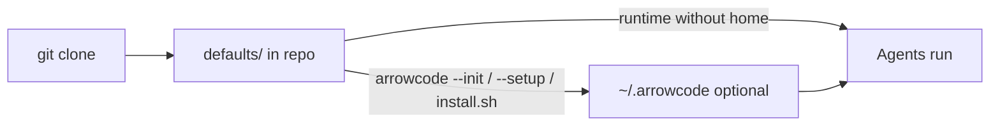

# Install ArrowCode

## Packaged defaults vs optional user home



- **In the repo:** `defaults/` (agents, templates, example config) — always present.  
- **On your machine:** `~/.arrowcode/` — **only** if you install/setup/init.  
- Copies **never overwrite** existing user files.

## One-liner (Linux / macOS / WSL)

```bash
curl -fsSL https://raw.githubusercontent.com/YOUR_USER/arrowcode/main/install.sh | bash
```

With API setup:

```bash
curl -fsSL https://raw.githubusercontent.com/YOUR_USER/arrowcode/main/install.sh | bash -s -- --setup
```

## One-liner (Windows PowerShell)

```powershell
irm https://raw.githubusercontent.com/YOUR_USER/arrowcode/main/install.ps1 | iex
```

```powershell
.\install.ps1 -Setup
```

## From a local clone

```bash
git clone https://github.com/YOUR_USER/arrowcode.git
cd arrowcode
chmod +x install.sh bin/arrowcode
./install.sh
# or
bun install && bun link
```

## Requirements

- [Bun](https://bun.sh) ≥ 1.1 (installers install Bun if missing)
- git (recommended)
- An OpenAI-compatible API key (NVIDIA NIM by default)

## After install

```bash
export PATH="$HOME/.local/bin:$PATH"   # if needed
arrowcode --setup
arrowcode --banner
cd /path/to/project
arrowcode
```

## Uninstall

```bash
rm -rf ~/.local/share/arrowcode   # default install dir (if used)
rm -f ~/.local/bin/arrowcode ~/.local/bin/ac
# optional user data:
# rm -rf ~/.arrowcode
```

Windows: remove `%USERPROFILE%\.arrowcode-app` and shims under `%USERPROFILE%\.local\bin`.

## Workspace data (per project)

```text
.arrowcode-sessions/      # session management
.arrowcode-checkpoints/   # /undo snapshots
```

Safe to delete; add to `.gitignore` (often auto-appended).
