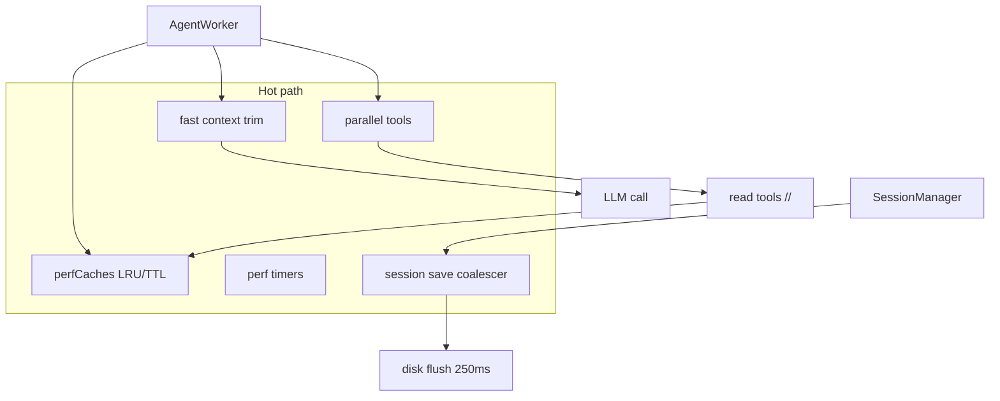

# Performance (lightning path)

ArrowCode adds a dedicated `src/perf/` kit so the harness stays **large in capability** but **small in latency**.

## Architecture



## Speed techniques

| Technique | Where | Effect |
|-----------|--------|--------|
| Personality LRU cache | `personalities.ts` | Avoid re-reading md every turn |
| System prompt cache | `prompts.ts` | Skip rebuild when phase/goal/plan unchanged |
| Project brain TTL | `prompts.ts` | Cache ARROW.md 10s |
| File content LRU | `read_file` | Hit cache on re-read |
| Parallel read tools | `worker.ts` | Up to 8 concurrent read-only tools |
| Pure-trim context | `fast-context.ts` | Skip LLM summarize until far over budget |
| Idle poll 120ms / settle 400ms | `harness.ts` | Faster phase completion |
| Session save coalesce 250ms | `session/manager.ts` | Fewer fsyncs under tool storms |
| Cache invalidate on write | tools/worker | Correctness after mutations |

## Commands

```text
/perf          # timers + counters + cache sizes
/perf reset    # clear counters and caches
```

## Parallel safety

Only **read-only** tools run concurrently:

`read_file list_dir tree glob grep search_files find_symbol think git_status diff_workspace swarm_status memory_read notebook_read`

Writes, bash, and multi_edit stay **sequential** (checkpoints + ordering).

## Tuning knobs (`src/perf/index.ts`)

- `toolConcurrency` (default 8)
- `sessionSaveMs` (250)
- `idlePollMs` (120)
- `idleSettleMs` (400)
- pure-trim bias until 1.5× summarize threshold

## Benchmark mindset

Hot path should avoid:

1. Disk on every tool  
2. Full prompt rebuild every token batch  
3. Serial reads of independent files  
4. LLM summarize for modest histories  
