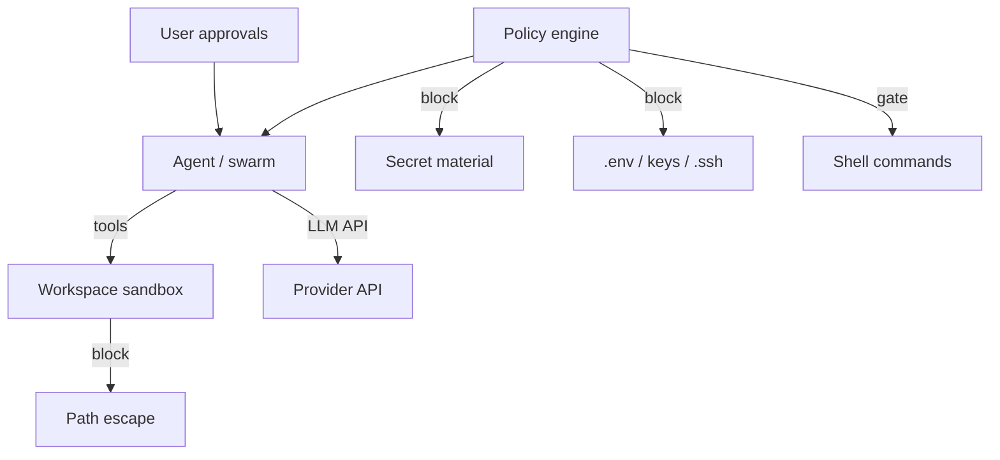

# Security

## Threat model (summary)

## Controls

| Control | Default | Command |
|---------|---------|---------|
| Workspace path sandbox | on | (always) |
| Sensitive path deny | on | (policy) |
| Secret content scan on write | on | `/secretscan on\|off` |
| Bash allowlist auto-approve | on | `/allowlist on\|off` |
| Dry-run (no writes) | off | `/dryrun on\|off` |
| Token budget soft-stop | off | `/budget N` |
| YOLO full auto-approve | off | `/yolo` |
| User approval for write/bash | on unless YOLO/allowlist | y/n prompts |

## Deny path patterns

- `.env`, `.env.*`
- `secrets/`, `credentials.*`
- `id_rsa`, `.aws/`, `.ssh/`

## Bash allowlist (examples)

- `npm test`, `npm run typecheck|lint|build`
- `pytest`, `cargo test`, `go test`
- `git status|diff|log|branch`
- `tsc --noEmit`

## Secrets

Do not store API keys in the repo. Use env or optional `~/.arrowcode/.env` **after** install/setup only.

## Checkpoints

Undo snapshots live in **`.arrowcode-checkpoints/`** inside the project (not a global home dir).

## Sessions

Session memory is workspace-local (`.arrowcode-sessions/`). Treat it as project data; do not paste production secrets into `/session memory`.
