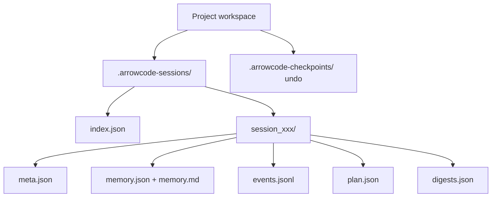
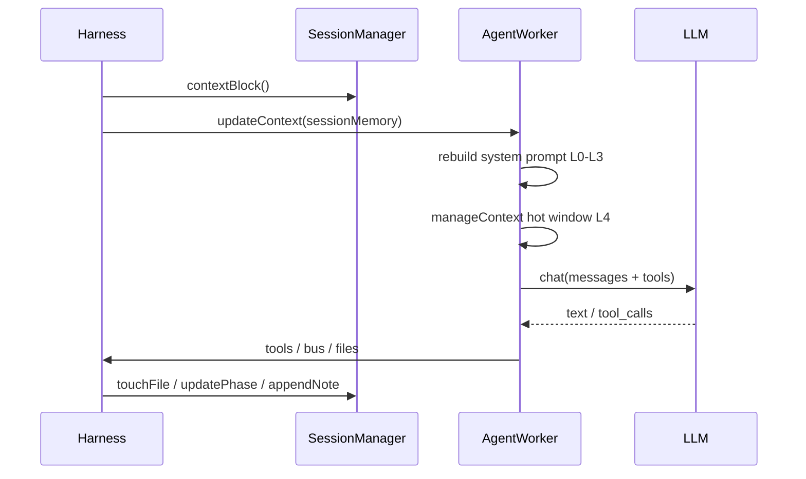

# Sessions & context

## Why sessions matter

Without session management, each run is amnesiac. ArrowCode keeps **workspace-local** sessions so you can pause, resume, and inject durable memory into every agent turn — without requiring a global `~/.arrowcode` directory.

## Where data lives

Both folders should be gitignored (auto-appended when possible).

## Commands

| Command | Action |
|---------|--------|
| `/session new [name]` | Start a new session |
| `/session list` or `/sessions` | List sessions (`*` = active) |
| `/session load <id>` | Resume phase, goal, plan, memory |
| `/session save` | Force flush to disk |
| `/session memory` | Print durable memory block |
| `/session memory <note>` | Append a decision/note |
| `/session delete <id>` | Remove session files |

## Context assembly (every model call)

### Layer budgets (defaults)

| Layer | Content | Approx budget |
|-------|---------|----------------|
| L0 | System + personality + security | fixed |
| L1 | Workspace snapshot + ARROW.md | ~12k chars |
| L2 | Goal + plan | ~8k |
| L3 | Session durable memory | ~8k tail |
| L4 | Hot messages | `contextBudgetChars` (~120k main, lower workers) |
| L5 | Tool outputs | truncated ~80k |

When L4 is large:

1. **Summarize** middle turns → store `lastSummary` in session memory (L3)  
2. **Trim** oldest messages; keep system + recent; sanitize tool pairs  

## Security notes

- Session files stay **inside the workspace** (not uploaded).  
- Secrets should not be written into `memory.md` (secret scan blocks many key patterns on file writes).  
- `/dryrun`, path deny, and allowlists still apply while a session is active.

## Good practice

1. `/session new auth-feature` before a big task  
2. `/plan ...` → `/confirm` → work  
3. `/session memory Decided JWT not sessions` for important decisions  
4. `/session save` before leaving  
5. Later: `/session load auth-feature_...`  

## Resume behavior

On `load`:

- Restores `phase`, `goal`, `plan` into the harness  
- Re-injects memory into all agents on next turn  
- Does **not** replay full tool transcripts (use `/replay` timeline export for that)
