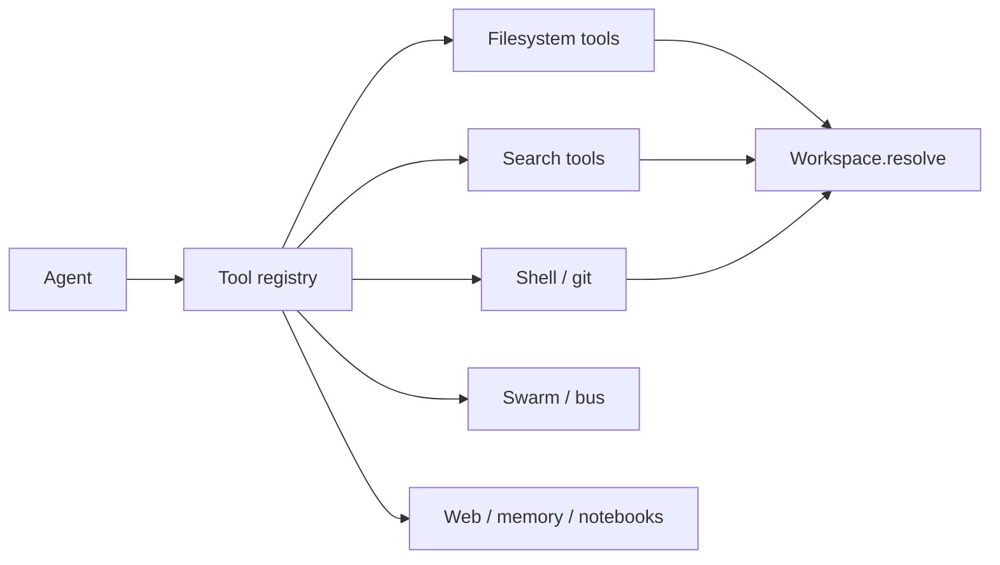
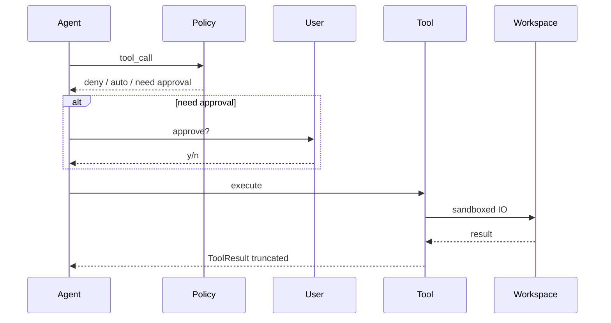

# Built-in tools

All file paths are sandboxed to the workspace root.

## Filesystem

| Tool | Approval | Description |
|------|----------|-------------|
| `read_file` | no | Read text file (line offset/limit) |
| `write_file` | yes* | Create / overwrite |
| `edit_file` | yes* | Exact string replace |
| `multi_edit` | yes* | Many edits across files |
| `delete_file` | yes* | Delete a file |
| `move_file` | yes* | Rename / move |
| `list_dir` | no | List directory |
| `tree` | no | Depth-limited tree view |

\* Subject to policy (dry-run, deny paths, secret scan) and user approval unless YOLO.

## Search

| Tool | Approval | Description |
|------|----------|-------------|
| `glob` | no | Glob patterns |
| `grep` | no | Regex content search |
| `search_files` | no | Filename substring search |
| `find_symbol` | no | Likely symbol definitions |

## Shell & git

| Tool | Approval | Description |
|------|----------|-------------|
| `bash` | yes* | Shell in workspace |
| `git_status` | no | Branch, status, log, diff stat |
| `diff_workspace` | no | `git diff` |
| `diagnostics` | yes* | typecheck / lint / test auto-detect |

\* Allowlisted bash may auto-approve when `/allowlist on`.

## Swarm & coordination

| Tool | Approval | Description |
|------|----------|-------------|
| `message_agent` | no | Bus message to agent/worker |
| `spawn_worker` | no | Spawn swarm child |
| `swarm_status` | no | Worker tree + caps |
| `todo_write` | no | Task list |
| `think` | no | Scratchpad |

## Other

| Tool | Approval | Description |
|------|----------|-------------|
| `web_fetch` | yes | HTTP GET, HTML stripped |
| `notebook_read` | no | Read `.ipynb` cells |
| `memory_append` | no | Note in optional user home memory |
| `memory_read` | no | Read home memory if present |

## Tool loop

